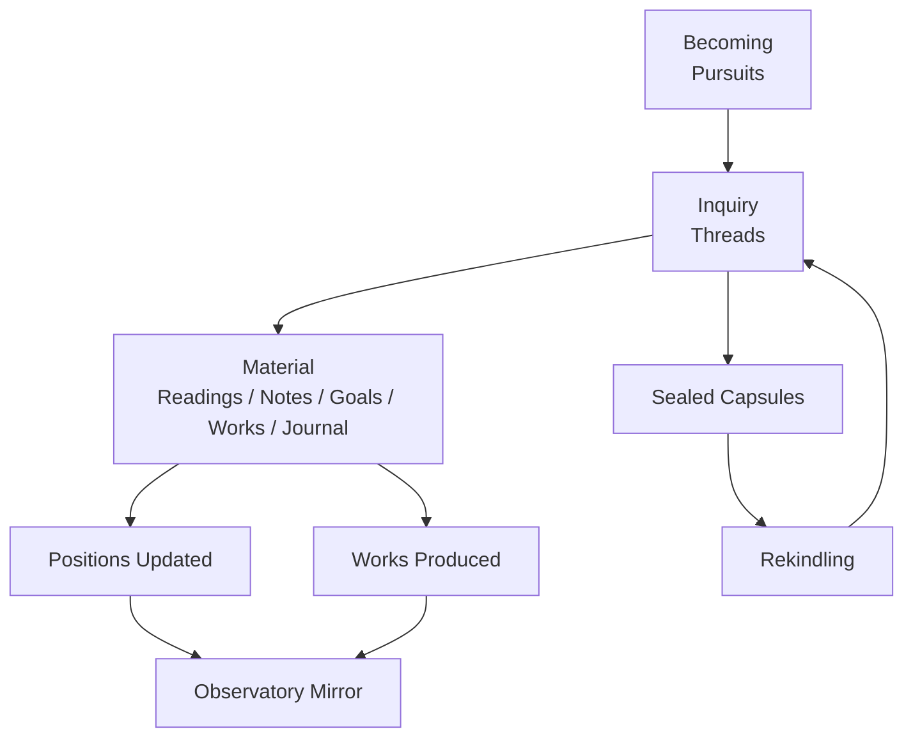
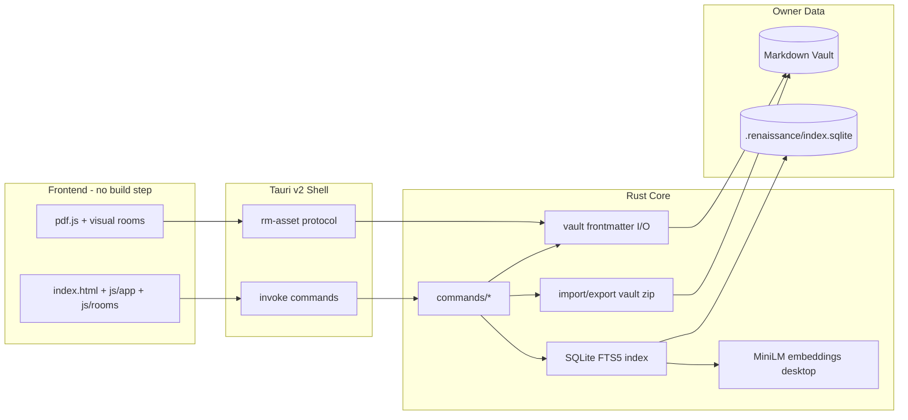
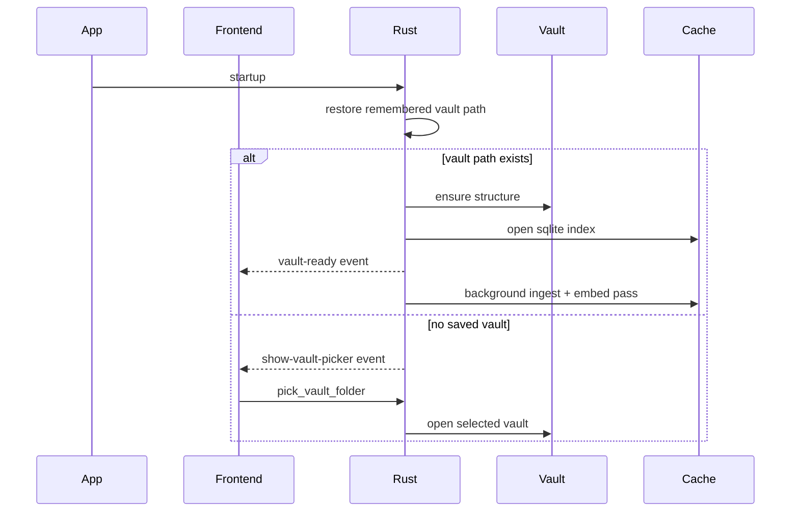

# Renaissance Man

<p align="center">
  <b>An intellectual operating system for becoming.</b><br/>
  Local-first. File-native. Quiet by design.
</p>

<p align="center">
  
  
  
  
  
  
</p>

---

## The Idea

Renaissance Man is not a notes app and not a task app.
It is built around one primitive: **becoming**.

You do not manage files. You pursue a question, return later, and the system gives you your context back with almost zero re-entry cost.

### The 3-Layer Model

```text
BECOMING   -> pursuits (who you are turning into)
INQUIRY    -> threads  (the live questions)
MATERIAL   -> readings, notes, goals, works, journal
```

---

## Why This Exists

Most tools optimize for storage, organization, and engagement.
This one optimizes for:

- Free re-entry after attention pivots
- Learning that compounds across domains
- Production in your own words
- Thirty-year durability of your intellectual record

---

## Signature Principles

- **Files are truth**: plain Markdown + frontmatter in your own vault
- **Everything else is cache**: SQLite index, vectors, derived graph
- **Local-first**: core workflows do not depend on cloud services
- **One-ask economy**: no noisy notification loop, no shame surfaces
- **Structural AI gate**: AI writes to proposals, not to human ground

---

## Product Topology (Visual)



---

## System Architecture



---

## Room Atlas

| Room | Core Purpose | Typical Loop |
|---|---|---|
| Threshold | One next thing, not a dashboard | Return -> pick one -> re-enter |
| Reading Room | Keep what you read with intent | Read -> highlight -> why |
| Atlas | Map cross-domain structure | Connect -> bridge -> constellate |
| Studio | Build and train | Plan -> do -> record output |
| Cabinet | Keep the wishbook alive | Capture wish -> revisit in season |
| Observatory | Honest temporal mirror | Weekly shape -> season -> annual letter |
| Study | Long-form production surface | Draft -> refine -> publish to Works |

---

## Data Model (Vault-First)

```text
Pursuits/     identity and direction
Threads/      living questions + sealed capsules + next probe
Readings/     source material + highlights + intent
Notes/        syntheses, ideas, logs, plans
Goals/        mastery, numeric, habit ladders
Works/        what was actually made
Body/         training records
Journal/      captures, tasks, weekly, season, annual letter
Proposals/    AI-generated suggestions (quarantine gate)
.renaissance/ disposable cache/index/vector state
```

---

## Repo Map

```text
Renaissance-Man/
  frontend/
    index.html
    js/
      app/
      rooms/
      lib/
  src-tauri/
    src/
      commands/
      db/
      vault/
```

---

## Tech Stack

- **Desktop shell**: Tauri 2
- **Frontend**: Vanilla JavaScript modules + HTML/CSS
- **Core**: Rust
- **Persistence**: Markdown files + YAML frontmatter + SQLite (FTS5)
- **Semantic retrieval**: local MiniLM embeddings on desktop (`fastembed`)
- **Mobile behavior**: semantic search gracefully degrades to FTS

---

## Quick Start

### 1) Prerequisites

Install:

- Rust toolchain
- Node.js + npm
- Tauri system prerequisites for your OS

### 2) Install JS dependency

```bash
npm install
```

### 3) Run in dev mode

```bash
npm run dev
```

### 4) Build desktop bundle

```bash
npm run build
```

Current package targets are configured for **NSIS** installer output on Windows.

---

## How Vault Opening Works



---

## AI Boundary (Covenant)

AI support is intentionally constrained:

- Can: search, find similarity, detect gaps, generate proposals
- Cannot: directly write your threads/notes/works/pursuits
- Writes only to: `Proposals/` and machine cache layers
- Adoption path: human restatement into human-ground files

This preserves learning by articulation instead of outsourcing thought.

---

## Performance Posture

- Fast first paint and non-blocking ingest strategy
- Incremental indexing and background embedding passes
- Lazy page rendering and optimized reading flow
- Local retrieval path designed for large personal vaults

---

## Development Notes

- Frontend intentionally avoids heavy frameworks and build pipelines
- Rust command surface is explicit and room-driven
- Vault format is intentionally Obsidian-compatible and long-lived
- Cache can be rebuilt from files at any time

---

## Status

This project is in active iteration.
Current codebase combines desktop-first craftsmanship with mobile-aware architecture and a long-horizon model of knowledge work.

If you are exploring the code, start from:

1. `src-tauri/src/lib.rs` for app lifecycle + command registration
2. `src-tauri/src/commands/` for capability boundaries
3. `frontend/js/app/codex.js` for room orchestration
4. `frontend/js/app/vault.js` for bridge/loading behavior

---

## Closing

Renaissance Man is designed to be quiet software that survives your absences,
remembers your reasons, and helps scattered interests become one continuous craft.

---

## License

MIT — see [LICENSE](LICENSE).
